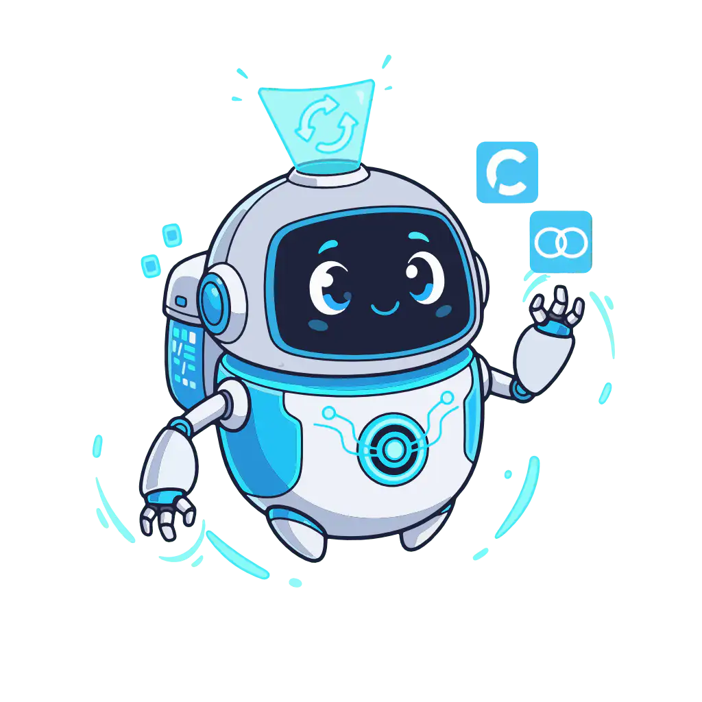

# AgentSync

[](https://github.com/dallay/agentsync/actions/workflows/ci.yml)
[](https://github.com/dallay/agentsync/actions/workflows/release.yml)
[](https://opensource.org/licenses/MIT)
[](https://github.com/dallay/agentsync/releases)
[](https://codecov.io/gh/dallay/agentsync)
[](https://sonarcloud.io/summary/new_code?id=dallay_agentsync)
[](https://sonarcloud.io/summary/new_code?id=dallay_agentsync)
[](https://sonarcloud.io/summary/new_code?id=dallay_agentsync)
[](https://sonarcloud.io/summary/new_code?id=dallay_agentsync)
[](https://sonarcloud.io/summary/new_code?id=dallay_agentsync)
[](https://sonarcloud.io/summary/new_code?id=dallay_agentsync)
[](https://sonarcloud.io/summary/new_code?id=dallay_agentsync)
[](https://sonarcloud.io/summary/new_code?id=dallay_agentsync)
[](https://sonarcloud.io/summary/new_code?id=dallay_agentsync)
[](https://sonarcloud.io/summary/new_code?id=dallay_agentsync)
[](https://sonarcloud.io/summary/new_code?id=dallay_agentsync)

A fast, portable CLI tool for synchronizing AI agent configurations and MCP servers across multiple
AI coding assistants using symbolic links.



## Why AgentSync?

Different AI coding tools expect configuration files in various locations:

| Tool               | Instructions                      | Commands             | Skills             |
|--------------------|-----------------------------------|----------------------|--------------------|
| **Claude Code**    | `CLAUDE.md`                       | `.claude/commands/`  | `.claude/skills/`  |
| **GitHub Copilot** | `.github/copilot-instructions.md` | -                    | -                  |
| **Gemini CLI**     | `GEMINI.md`                       | `.gemini/commands/`  | `.gemini/skills/`  |
| **Cursor**         | `.cursor/rules/agentsync.mdc`     | -                    | `.cursor/skills/`  |
| **VS Code**        | -                                 | -                    | -                  |
| **OpenCode**       | `OPENCODE.md`                     | `.opencode/command/` | `.opencode/skills/` |
| **OpenAI Codex**   | `AGENTS.md`                       | -                    | `.codex/skills/`   |

AgentSync maintains a **single source of truth** in `.agents/` and creates symlinks to all required
locations.

## Features

- 🔗 **Symlinks over copies** - Changes propagate instantly
- 📝 **TOML configuration** - Human-readable, easy to maintain
- 📋 **Gitignore management** - Automatically updates `.gitignore`
- 🛡️ **Safe** - Automatically backs up existing files before replacing them
- 🖥️ **Cross-platform** - Linux, macOS, Windows
- 🚀 **CI-friendly** - Gracefully skips when binary unavailable
- ⚡ **Fast** - Single static binary, no runtime dependencies

## Installation

### Node.js Package Managers (Recommended)

If you have Node.js (>=18) installed, the easiest way to install AgentSync is through a package manager.

#### Global Installation

```bash
# Using npm
npm install -g @dallay/agentsync

# Using pnpm
pnpm add -g @dallay/agentsync

# Using yarn (Classic v1)
yarn global add @dallay/agentsync

# Using bun
bun i -g @dallay/agentsync
```

#### One-off Execution

If you want to run AgentSync without a permanent global installation:

```bash
# Using npx (npm)
npx @dallay/agentsync apply

# Using dlx (pnpm)
pnpm dlx @dallay/agentsync apply

# Using dlx (yarn v2+)
yarn dlx @dallay/agentsync apply

# Using bunx (bun)
bunx @dallay/agentsync apply
```

#### Local Installation (Dev Dependency)

```bash
# Using npm
npm install --save-dev @dallay/agentsync

# Using pnpm
pnpm add -D @dallay/agentsync

# Using yarn
yarn add -D @dallay/agentsync

# Using bun
bun add -d @dallay/agentsync
```

### From crates.io (Rust)

If you have Rust installed, you can install AgentSync directly from [crates.io](https://crates.io/crates/agentsync):

```bash
cargo install agentsync
```

### From GitHub Releases (Pre-built Binaries)

Visit the [GitHub Releases](https://github.com/dallay/agentsync/releases) page to find the latest version number and correct platform identifier for your system.

To install via terminal, you can use the following script (be sure to replace the `<version>` placeholder with a real tag, e.g., `1.28.0`):

```bash
# Define version and platform
VERSION="<version>"
# Detect architecture (macOS)
PLATFORM=$([ "$(uname -m)" = "arm64" ] && echo "aarch64-apple-darwin" || echo "x86_64-apple-darwin")
# Or specify manually for Linux, e.g., x86_64-unknown-linux-gnu
# PLATFORM="x86_64-unknown-linux-gnu"
TARBALL="agentsync-${VERSION}-${PLATFORM}.tar.gz"

# Download binary and checksum
curl -LO "https://github.com/dallay/agentsync/releases/download/v${VERSION}/${TARBALL}"
curl -LO "https://github.com/dallay/agentsync/releases/download/v${VERSION}/${TARBALL}.sha256"

# Verify integrity
if command -v sha256sum >/dev/null; then
  sha256sum --check "${TARBALL}.sha256"
else
  shasum -a 256 --check "${TARBALL}.sha256"
fi

if [ $? -ne 0 ]; then
  echo "Error: Checksum verification failed!"
  exit 1
fi

# Extract and install
tar xzf "${TARBALL}"
sudo mv agentsync-*/agentsync /usr/local/bin/
```

### From Source (Requires Rust 1.89+)

Install directly from the GitHub repository (requires Node.js 22.22.0+ and Rust 1.89+):

```bash
cargo install --git https://github.com/dallay/agentsync
```

Or clone and build manually:

```bash
git clone https://github.com/dallay/agentsync
cd agentsync
cargo build --release

# The binary will be available at ./target/release/agentsync

```

## Quick Start

### New Projects

1. **Initialize configuration** in your project:

```bash
cd your-project
agentsync init
```

This creates `.agents/agentsync.toml` with a default configuration.

### Existing Projects with Agent Files

If you already have agent configuration files scattered across your project (like `CLAUDE.md`, `.cursor/`, or `.github/copilot-instructions.md`), use the interactive wizard:

```bash
cd your-project
agentsync init --wizard
```

The wizard will scan for existing files, let you select which to migrate, and set up everything automatically.

---

2. **Edit the configuration** to match your needs (see [Configuration](#configuration))

3. **Apply the configuration**:

```bash
agentsync apply
```

4. **Add to your project setup** (e.g., `package.json`):

```json
{
  "scripts": {
    "prepare": "agentsync apply || true"
  }
}
```

### Team workflow note

AgentSync defaults to managed `.gitignore` mode (`[gitignore].enabled = true`), which is the recommended starting point for most teams. If your team intentionally wants to commit AgentSync-managed destinations instead, treat `[gitignore].enabled = false` as an explicit opt-out workflow. See the canonical guide: https://dallay.github.io/agentsync/guides/gitignore-team-workflows/

If you run AgentSync from Windows and need native symlink prerequisites, WSL guidance, or recovery steps, use the dedicated setup guide: https://dallay.github.io/agentsync/guides/windows-symlink-setup/

## Usage

```bash
# Initialize a new configuration
agentsync init

# Initialize with interactive wizard (for existing projects with agent files)
agentsync init --wizard

# Apply configuration (create symlinks)
agentsync apply

# Clean existing symlinks before applying
agentsync apply --clean

# Remove all managed symlinks
agentsync clean

# Use a custom config file
agentsync apply --config /path/to/config.toml

# Dry run (show what would be done without making changes)
agentsync apply --dry-run

# Skip gitignore reconciliation for this run only
agentsync apply --no-gitignore

# Filter by agent
agentsync apply --agents claude,copilot

# Verbose output
agentsync apply --verbose

# Show status of managed symlinks
agentsync status

# Run diagnostic and health check
agentsync doctor [--project-root <path>]

# Manage skills
agentsync skill install <skill-id>
agentsync skill update <skill-id>
agentsync skill uninstall <skill-id>
```

### Status

Verify the state of symlinks managed by AgentSync. Useful for local verification and CI.

```bash
agentsync status [--project-root <path>] [--json]
```

- `--project-root <path>`: Optional. Path to the project root to locate the agentsync config.
- `--json`: Output machine-readable JSON (pretty-printed).

Exit codes: 0 = no problems, 1 = problems detected (CI-friendly)

## Configuration

Configuration is stored in `.agents/agentsync.toml`:

```toml
# Source directory (relative to this config file)
source_dir = "."

# Optional: compress AGENTS.md and point symlinks to the compressed file
# compress_agents_md = false

# Default agents to run when --agents is not specified.
# If empty, all enabled agents will be processed.
default_agents = ["claude", "copilot"]

# Gitignore management
[gitignore]
enabled = true
marker = "AI Agent Symlinks"
# Additional entries to add to .gitignore (target destinations are added automatically)
entries = []

# Agent definitions
[agents.claude]
enabled = true
description = "Claude Code - Anthropic's AI coding assistant"

[agents.claude.targets.instructions]
source = "AGENTS.md"
destination = "CLAUDE.md"
type = "symlink"

[agents.claude.targets.commands]
source = "command"
destination = ".claude/commands"
type = "symlink-contents"
pattern = "*.agent.md"
```

### MCP Support (Model Context Protocol)

AgentSync can automatically generate MCP configuration files for supported agents (Claude Code,
GitHub Copilot, OpenAI Codex CLI, Gemini CLI, Cursor, VS Code, OpenCode).

This allows you to define MCP servers once in `agentsync.toml` and have them synchronized to all
agent-specific config files.

```toml
[mcp]
enabled = true

# Strategy for existing files: "merge" (default) or "overwrite"
# "merge" preserves existing servers but overwrites conflicts with TOML config
merge_strategy = "merge"

# Define servers once
[mcp_servers.filesystem]
command = "npx"
args = ["-y", "@modelcontextprotocol/server-filesystem", "."]

[mcp_servers.git]
command = "npx"
args = ["-y", "@modelcontextprotocol/server-git", "--repository", "."]

# Optional fields:
# env = { "KEY" = "VALUE" }
# disabled = false
```

#### Supported Agents (canonical)

AgentSync supports the following agents and will synchronize corresponding files/locations. This list is canonical — keep it in sync with `src/mcp.rs` (authoritative).

- **Claude Code** — `.mcp.json` (agent id: `claude`)
- **GitHub Copilot** — `.vscode/mcp.json` (agent id: `copilot`)
- **OpenAI Codex CLI** — `.codex/config.toml` (agent id: `codex`) — TOML format with `[mcp_servers.<name>]` tables. AgentSync maps `headers` to Codex `http_headers`.
- **Gemini CLI** — `.gemini/settings.json` (agent id: `gemini`) — AgentSync will add `trust: true` when generating Gemini configs.
- **Cursor** — `.cursor/mcp.json` (agent id: `cursor`)
- **VS Code** — `.vscode/mcp.json` (agent id: `vscode`)
- **OpenCode** — `opencode.json` (agent id: `opencode`)

AgentSync also supports 32+ agents (7 native MCP agents and 25+ configurable agents) including Windsurf, Cline, Amazon Q, Aider, RooCode, Trae, and more. See the [full list in the documentation](https://dallay.github.io/agentsync/reference/configuration/).

See the [MCP Integration Guide](https://dallay.github.io/agentsync/guides/mcp/) for formatter details and merge behavior.

#### Merge Behavior

When `merge_strategy = "merge"`:

1. AgentSync reads the existing config file (if it exists).
2. It adds servers defined in `agentsync.toml`.
3. **Conflict Resolution**: If a server name exists in both, the definition in `agentsync.toml` **wins** and overwrites the existing one.
4. Existing servers NOT in `agentsync.toml` are preserved.

### Target Types

| Type               | Description                                                   |
|--------------------|---------------------------------------------------------------|
| `symlink`          | Create a symlink to the source file/directory                 |
| `symlink-contents` | Create symlinks for each item in the source directory         |
| `nested-glob`      | Recursively discover files and create symlinks for each match |
| `module-map`       | Map centrally-managed source files to module directories      |

The `symlink-contents` type optionally supports a `pattern` field (glob pattern like `*.md`) to
filter which items to link.

#### Nested Glob Target (`nested-glob`)

The `nested-glob` type discovers files matching a recursive glob pattern and creates a symlink
for each discovered file.  This is ideal for **monorepos and multi-module projects** where
different subdirectories contain their own `AGENTS.md` files.

```toml
[agents.claude.targets.nested]
# Root directory to search (relative to the project root)
source = "."

# Glob pattern – supports ** for multi-level directory matching
pattern = "**/AGENTS.md"

# Paths to exclude (matched against each file's path relative to source)
exclude = [
    ".agents/**",
    "node_modules/**",
    "**/target/**",
    "**/build/**",
    "**/dist/**",
    "**/.git/**",
]

# Destination template – placeholders replaced for each discovered file:
#   {relative_path}  parent directory relative to `source`  (e.g. clients/agent-runtime)
#                    For files at the root of `source`, this is "." (not empty)
#   {file_name}      file name                               (e.g. AGENTS.md)
#   {stem}           file name without extension             (e.g. AGENTS)
#   {ext}            file extension without leading dot      (e.g. md)
destination = "{relative_path}/CLAUDE.md"

type = "nested-glob"
```

Given the structure:

```
project-root/
├── .agents/
│   └── AGENTS.md          # excluded by .agents/**
├── clients/
│   └── agent-runtime/
│       └── AGENTS.md      # → clients/agent-runtime/CLAUDE.md
└── modules/
    └── core-kmp/
        └── AGENTS.md      # → modules/core-kmp/CLAUDE.md
```

AgentSync would create:

- `clients/agent-runtime/CLAUDE.md` → symlink to `clients/agent-runtime/AGENTS.md`
- `modules/core-kmp/CLAUDE.md` → symlink to `modules/core-kmp/AGENTS.md`


## Project Structure

```
.agents/
├── agentsync.toml      # Configuration file (source of truth for MCP)
├── AGENTS.md           # Main agent instructions (single source)
├── command/            # Agent commands
│   ├── review.agent.md
│   └── test.agent.md
├── skills/             # Shared knowledge/skills
│   └── kotlin/
│       └── SKILL.md
└── prompts/            # Reusable prompts
    └── code-review.prompt.md
```

After running `agentsync apply`:

```
project-root/
├── CLAUDE.md           → .agents/AGENTS.md
├── GEMINI.md           → .agents/AGENTS.md
├── AGENTS.md           → .agents/AGENTS.md
├── .mcp.json           (Generated from agentsync.toml)
├── .claude/
│   ├── commands/       → symlinks to .agents/command/*.agent.md
│   └── skills/         → symlinks to .agents/skills/*
├── .gemini/
│   ├── settings.json   (Generated from agentsync.toml)
│   ├── commands/       → symlinks to .agents/command/*.agent.md
│   └── skills/         → symlinks to .agents/skills/*
└── .github/
    ├── copilot-instructions.md → .agents/AGENTS.md
    └── agents/         → symlinks to .agents/command/*.agent.md
```

## CI/CD Integration

AgentSync gracefully handles CI environments where the binary isn't available:

```json
{
  "scripts": {
    "agents:sync": "pnpm exec agentsync apply",
    "prepare": "lefthook install && pnpm run agents:sync"
  }
}
```

The symlinks are primarily for local development. CI builds typically don't need them.

### Installing in CI

If you need agentsync in CI, you can download the latest version automatically using `jq` for robust parsing:

```yaml
- name: Install agentsync
  env:
    GH_TOKEN: ${{ secrets.GITHUB_TOKEN }}
  run: |
    # Fetch latest version using GitHub API and jq
    LATEST_TAG=$(curl -s -H "Authorization: Bearer $GH_TOKEN" \
      https://api.github.com/repos/dallay/agentsync/releases/latest | jq -r '.tag_name')
    
    if [ "$LATEST_TAG" == "null" ] || [ -z "$LATEST_TAG" ]; then
      echo "Error: Failed to fetch latest release tag"
      exit 1
    fi
    
    VERSION=${LATEST_TAG#v}
    PLATFORM="x86_64-unknown-linux-gnu"
    
    curl -LO "https://github.com/dallay/agentsync/releases/download/${LATEST_TAG}/agentsync-${VERSION}-${PLATFORM}.tar.gz"
    tar xzf agentsync-${VERSION}-${PLATFORM}.tar.gz
    sudo mv agentsync-*/agentsync /usr/local/bin/
```

## Getting Started (Development)

This project is a monorepo containing a Rust core and a JavaScript/TypeScript wrapper.

### Repository Structure

- `src/`: Core logic and CLI implementation in **Rust**.
- `npm/agentsync/`: **TypeScript** wrapper used for NPM distribution.
- `website/docs/`: Documentation site built with **Starlight**.
- `tests/`: Integration tests for the CLI.

### Prerequisites

- [**Rust**](https://www.rust-lang.org/tools/install) (1.89+ recommended)
- [**Node.js**](https://nodejs.org/) (v22.22.0+ recommended for development)
- [**pnpm**](https://pnpm.io/installation)

### Setup

1.  **Install JavaScript dependencies:**

    ```bash
    pnpm install
    ```

2.  **Build the Rust binary:**

    ```bash
    cargo build
    ```

### Common Commands

This project uses a `Makefile` to orchestrate common tasks.

-   **Run Rust tests:**

    ```bash
    make rust-test
    ```

-   **Run JavaScript tests:**

    ```bash
    make js-test
    ```

-   **Build all components:**

    ```bash
    make all
    ```

-   **Run full verification (lint + build + test):**

    ```bash
    make verify-all
    ```

-   **Lint the code:**

    ```bash
    # Rust
    cargo clippy
    # JavaScript/TypeScript
    pnpm run biome:check
    ```

-   **Format the code:**

    ```bash
    make fmt
    ```

### Release Process

Releases are managed via `semantic-release` and GitHub Actions. To trigger a dry run locally:

```bash
pnpm run release:dry-run
```

## Troubleshooting

### `PNPM_NO_MATURE_MATCHING_VERSION`

If `pnpm install` fails with this error, it's likely due to a strict package release age policy. You can try installing with `--ignore-scripts` or wait for the package to "mature" in the registry.

### Lefthook installation failure

If `pnpm install` fails during the `lefthook` setup, you can try:

```bash
pnpm install --ignore-scripts
```

### Build failures (Rust)

Ensure you have the latest stable Rust toolchain installed. You can update with `rustup update stable`.

### Symlink creation fails on Windows

Use the dedicated Windows setup guide for native prerequisites, WSL positioning, verification, and recovery steps: https://dallay.github.io/agentsync/guides/windows-symlink-setup/

## Inspiration

- [Ruler](https://github.com/intellectronica/ruler) - Similar concept but copies files instead of
  using symlinks

## Contributing

Contributions are welcome! Please see [CONTRIBUTING.md](CONTRIBUTING.md) for guidelines on how to get started.

## License

MIT License - see [LICENSE](LICENSE) for details.
