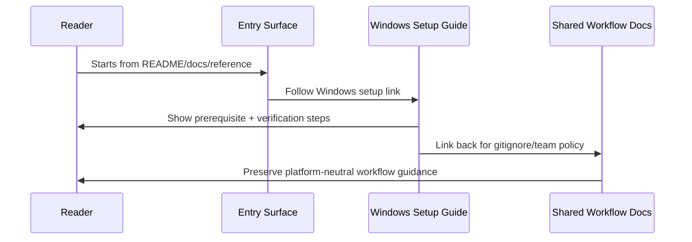

# Design: Document Windows Symlink Setup

## Technical Approach

This is a docs-only information architecture change. The implementation will add one canonical
Windows setup guide at `website/docs/src/content/docs/guides/windows-symlink-setup.mdx`, then trim
existing Windows mentions across high-traffic docs and README surfaces down to short, stable
cross-links that point to that guide.

The design keeps workflow policy and product defaults in the existing shared docs, while moving only
Windows-specific environment readiness content into the new guide. No CLI behavior, config
semantics, or symlink implementation changes are required.

## Architecture Decisions

### Decision: Make one guide the canonical Windows destination

**Choice**: Create `website/docs/src/content/docs/guides/windows-symlink-setup.mdx` as the single
source of truth for Windows symlink prerequisites, verification, recovery, WSL usage, and mixed-team
maintainer notes.

**Alternatives considered**: Expand `guides/getting-started.mdx`; expand
`guides/gitignore-team-workflows.mdx`; scatter Windows steps across README/reference pages.

**Rationale**: The proposal explicitly wants a dedicated, linkable page without bloating workflow
docs. One canonical page reduces drift and gives all other surfaces a stable target.

### Decision: Keep existing workflow and reference pages brief

**Choice**: Update supporting pages so they mention Windows only where it affects reader navigation,
then link out instead of embedding full setup instructions.

**Alternatives considered**: Repeat the full Windows checklist in getting-started, CLI,
configuration, and README pages.

**Rationale**: The repository already treats guides and references differently. Duplicating platform
setup across multiple pages would create maintenance overhead and conflicting guidance.

### Decision: Place the new page directly in the Guides sidebar

**Choice**: Add the new guide to the manual `sidebar` array in `website/docs/astro.config.mjs`, near
other onboarding/setup guides.

**Alternatives considered**: Rely only on in-page links; surface the page only from the docs
homepage.

**Rationale**: The docs sidebar is hand-curated, so the new page will not become discoverable
automatically. Adding it there makes the canonical page reachable even when a reader starts from
docs navigation instead of a link.

### Decision: Use command-focused examples instead of broad troubleshooting prose

**Choice**: The new guide will use short, actionable command examples for prerequisite setup,
verification, and recovery.

**Alternatives considered**: Narrative-only prose with no commands; a broad troubleshooting catalog.

**Rationale**: The proposal calls for actionable setup help, but scope excludes a full Windows
troubleshooting manual. Commands provide practical guidance while keeping the page concise.

## Data Flow

Reader navigation flow:

```text
README / npm README / docs index / getting started / workflow / reference
                     │
                     └──→ guides/windows-symlink-setup
                                │
                                ├── prerequisites (Developer Mode / elevation / WSL framing)
                                ├── verify setup and symlink health
                                ├── recover from common local setup issues
                                └── link back to shared workflow docs for team policy
```

Documentation update flow:



## File Changes

| File                                                                | Action | Description                                                                                                                   |
|---------------------------------------------------------------------|--------|-------------------------------------------------------------------------------------------------------------------------------|
| `website/docs/src/content/docs/guides/windows-symlink-setup.mdx`    | Create | Canonical Windows setup guide covering prerequisites, WSL guidance, verification, recovery, and maintainer notes.             |
| `website/docs/astro.config.mjs`                                     | Modify | Add the new guide to the Guides sidebar for direct discoverability.                                                           |
| `website/docs/src/content/docs/guides/gitignore-team-workflows.mdx` | Modify | Replace the current platform note with a direct link to the Windows guide and keep workflow content platform-neutral.         |
| `website/docs/src/content/docs/guides/getting-started.mdx`          | Modify | Add a brief Windows note near install/apply guidance that points to the dedicated setup guide.                                |
| `website/docs/src/content/docs/reference/cli.mdx`                   | Modify | Add a concise link near `apply` and/or `status` guidance for Windows readers who need environment setup or verification help. |
| `website/docs/src/content/docs/reference/configuration.mdx`         | Modify | Add a brief cross-link where symlink target behavior intersects with Windows setup expectations.                              |
| `website/docs/src/content/docs/index.mdx`                           | Modify | Surface the new guide from the docs landing page, most likely in the cross-platform/quick-start area.                         |
| `README.md`                                                         | Modify | Replace the existing one-line Windows symlink troubleshooting note with a canonical link to the new docs page.                |
| `npm/agentsync/README.md`                                           | Modify | Add a concise Windows setup link from the npm onboarding surface after `agentsync apply` or install guidance.                 |

## Interfaces / Contracts

No runtime interfaces, config contracts, or API surfaces change.

Content contract for the new guide:

- **Must include**:
    - native Windows prerequisites for creating symlinks
    - WSL guidance and when to prefer native-vs-WSL execution context
    - verification commands for AgentSync setup and symlink health
    - recovery steps for common local setup failures
    - maintainer notes for mixed Windows/macOS/Linux teams
- **Must not include**:
    - a re-explanation of the full default-vs-opt-out gitignore workflow
    - claims that Windows changes AgentSync defaults or product behavior

Cross-link contract for supporting pages:

- entry-point pages should use one or two sentences maximum for Windows-specific guidance
- Windows-specific details should point to `/guides/windows-symlink-setup/`
- workflow-policy pages should continue pointing to `/guides/gitignore-team-workflows/` for team
  process decisions

## Testing Strategy

| Layer              | What to Test                                                    | Approach                                                                                                                  |
|--------------------|-----------------------------------------------------------------|---------------------------------------------------------------------------------------------------------------------------|
| Content review     | Accuracy of page boundaries and cross-links                     | Manual review of each touched page to confirm Windows content is centralized and workflow content stays platform-neutral. |
| Docs integration   | Valid internal links, sidebar registration, and MDX compilation | Run `pnpm run docs:build` from the repository root.                                                                       |
| README consistency | Canonical Windows link appears in repo and npm README surfaces  | Manual grep/review plus docs build for site content; npm README checked in diff review.                                   |

## Migration / Rollout

No migration required.

Rollout is a single docs update that should land atomically so all major entry points link to the
canonical guide in the same change.

## Open Questions

- [ ] Confirm whether the docs homepage should add a dedicated Windows callout card or only a
  contextual text link in the existing quick-start/cross-platform sections.
- [ ] Confirm whether the new guide should include Windows-specific shell examples for both
  PowerShell and Command Prompt, or standardize on PowerShell plus one note about equivalent shells.
- [ ] Confirm the exact WSL recommendation wording so the guide does not overstate support
  boundaries beyond current documentation.
